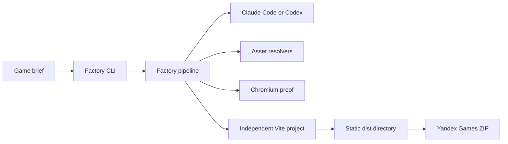
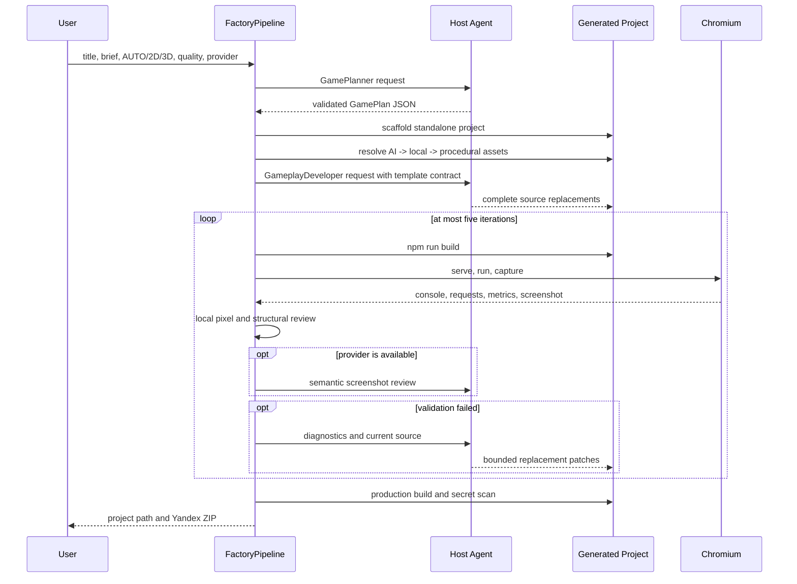

[Back to README](../README.md) · [API Reference →](api.md)

# Architecture Deep Dive

Yandex Games AI Factory is a deterministic TypeScript orchestrator around interchangeable host agents. It borrows Godogen's separation and proof discipline, but owns the repeatable tooling required for mass production.

## System Boundary



The factory exists only at creation time. Generated projects contain their own source, dependencies, Yandex adapter, quality runtime, and Vite configuration. Neither `dist/` nor the ZIP imports factory code or calls an AI service.

## Component Ownership

| Component | Owns | Must not own |
| --- | --- | --- |
| `src/pipeline/` | Stage ordering, progress, failure manifest | Engine rendering details |
| `src/agents/` | Planning, scaffolding, gameplay, fixes, packaging | Provider CLI syntax |
| `src/providers/` | Claude/Codex process protocols and response validation | Game engine policy |
| `src/asset-pipeline/` | AI/local/procedural resolution and provenance | Gameplay rules |
| `src/browser/` | Vite lifecycle, Chromium, evidence, visual gates, repair | Production packaging |
| `src/performance/` | Planning budgets and source injection | Runtime game mechanics |
| `templates/2d/` | Native Canvas runtime and five 2D presets | Babylon.js dependencies |
| `templates/babylon-base/` | Babylon engine, quality monitor, Yandex runtime | Factory orchestration |
| `templates/3d/` | Five 3D genre overlays and kinematic helpers | Host-agent selection |

Dependencies point inward toward small contracts: agents depend on `IProvider`, asset management depends on `AssetResolver`, and browser repair accepts injectable runner/tester/reviewer interfaces. Generated templates do not import from `src/`.

## End-to-End Pipeline



### 1. Input and provider selection

The interactive CLI validates a title, brief, rendering mode, quality, and provider. `auto` checks Claude Code before Codex. The provider is a physical executor; logical roles remain separate through `ProviderContext.role`.

### 2. Planning

`GamePlanner` asks for structured JSON and validates it with Zod. The plan decides native 2D versus Babylon 3D, genre, mechanics, asset requests, and LOW/MEDIUM/HIGH budget before source generation. Invalid planner output uses a conservative deterministic plan.

### 3. Scaffolding

`GameArchitect` calls `ScaffoldGenerator`, which validates the destination, rejects collisions, and copies templates without `node_modules` or `dist`. 3D combines `babylon-base` with a genre overlay; 2D copies only the Canvas template plus the engine-independent Yandex adapter.

The project records:

```text
.factory/game-plan.json
.factory/performance-budget.json
.factory/gameplay-generation.json
.factory/pipeline-result.json
.factory/evidence/latest.png
```

These artifacts support debugging and continuation but are excluded from the ZIP.

### 4. Asset resolution

`AssetManager` tries resolvers in fidelity order:

```text
optional network AI -> tagged local library -> deterministic procedural asset
```

Missing keys, network failures, and unmatched local tags are ordinary fallbacks. A resolved asset records source, output path or module code, license, and metadata. Secrets are read only by the factory process.

### 5. Gameplay generation

`GameplayDeveloper` gives the host agent the selected template module, mechanics, description, and budget. Replacement paths are constrained to TypeScript or CSS under `src/`. The template's exported contract stays stable, allowing the orchestrator and runtime to remain deterministic.

### 6. Browser proof

`BrowserTester` reserves a local port, starts Vite without a shell, launches headless Chromium with software WebGL compatibility flags, waits for `window.__GAME_READY__`, and captures:

- JavaScript console and page errors;
- failed resource requests;
- `window.__GAME_METRICS__`;
- a 1280 x 720 PNG screenshot;
- URL and duration.

Cleanup runs in `finally`, including process-group termination, so failed captures do not leave Vite or Chromium running.

### 7. Visual validation

`VisualReviewer` always runs local PNG checks. It rejects transparent, nearly black, or nearly uniform frames and merges runtime/request failures. When the host agent supports image inspection, semantic issues are added; vision failure cannot waive local gates.

### 8. Repair

`SelfRepairLoop` implements proof over claims:

```text
BUILD -> RUN -> CAPTURE -> ANALYZE -> FIX -> BUILD
```

Build failures and visual failures both become diagnostics. Replacement patches are path-checked before writing. Success returns every iteration and the final evidence; five failed iterations throw `RepairLoopExhaustedError` and fail the pipeline.

### 9. Production packaging

`BuildManager` rebuilds the project, verifies the Yandex SDK v2 script, scans output text for configured key values, archives only `dist/`, and places `index.html` at the ZIP root. Relative Vite URLs make the archive portable to Yandex hosting.

## 2D and 3D Paths

| Concern | Native 2D | Babylon.js 3D |
| --- | --- | --- |
| Renderer | Canvas 2D | WebGL through Babylon Engine |
| Update | Fixed 60 Hz accumulator | Babylon render loop |
| Physics | AABB helpers | Lightweight kinematic collision |
| Quality | Device pixel ratio and entity complexity | Scaling, shadows, particles, mesh budgets |
| Starting genres | Platformer, top-down shooter, clicker, idle, puzzle | Arena, FPS prototype, racing, runner, survival |
| Shared contracts | Ready flag, metrics, logging, Yandex adapter, Vite build | Same |

This split avoids shipping Babylon.js for games that need only sprites, shapes, text, and simple collision.

## Failure and Security Model

- User-derived project names become normalized slugs under an explicit root.
- Provider and repair writes are resolved and checked against project/source roots.
- Child processes use argument arrays with `shell: false`.
- Zod validates untrusted agent responses and local asset manifests.
- Asset credentials never use the `VITE_` prefix and are scanned out of production output.
- A missing SDK, ad, player, or asset API activates a fallback; a missing host agent is explicit because code generation cannot proceed without Claude Code or Codex.
- Build, browser, visual, and package failures stop the pipeline with structured context.

## Godogen Comparison

| Area | Current Godogen | Yandex Games AI Factory |
| --- | --- | --- |
| Product shape | Publishes a thin agent-enabled repository | Runs a reusable local orchestration application |
| Engine support | Godot, Bevy, Babylon guides | Native Canvas 2D and Babylon.js 3D runtimes |
| Host agents | Selected at publish time | Provider interface selected per run |
| Planning | Host agent decides dynamically | Validated `GamePlan` plus deterministic fallback |
| Tooling | Agent recreates much of the workflow | Factory owns scaffold, browser, repair, budgets, ZIP |
| Visual proof | Required behavior in runtime prompt | Programmatic gate with stored evidence |
| Repair | Agent-driven iteration | Logged loop capped at five iterations |
| Assets | Portable paid-generation skill | Optional AI, local catalog, procedural guarantee |
| Target platform | General engine project | Yandex Games static HTML5 package |
| Windows | Host setup varies | Docker Desktop plus batch entry points |

The transferred ideas are separation of host from engine, durable generated repositories, modular Babylon.js, and proof over claims. Godot/Bevy code, destructive publish behavior, mandatory paid assets, and prompt-only orchestration are intentionally not copied.

## Extension Points

- Implement `IProvider` to add another host CLI while preserving structured outputs.
- Add an `AssetResolver` before the procedural resolver for an internal catalog or service.
- Add a template preset without changing the orchestrator if it keeps the ready, metrics, build, and Yandex contracts.
- Inject browser and repair dependencies to run deterministic acceptance scenarios.

## See Also

- [API Reference](api.md) — concrete public contracts
- [Godogen Analysis](godogen-analysis.md) — source research behind the architecture
- [Yandex Adaptations](yandex-adaptations.md) — platform-specific decisions and constraints
